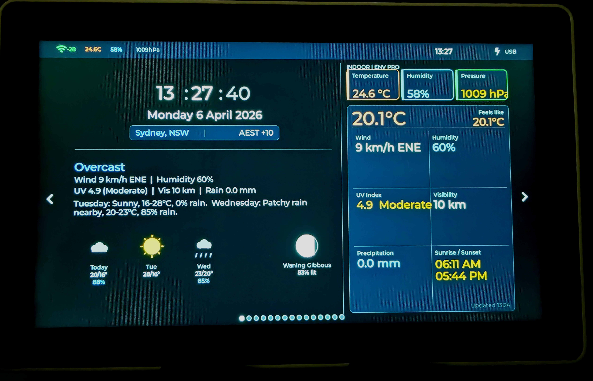

# Tab5 Weather Dashboard

A feature-rich, data-dense weather and environment dashboard for the **M5Stack Tab5** (ESP32-P4), built with Arduino and LVGL 8.x. Fourteen swipeable screens cover everything from live indoor air quality to real-time earthquake activity, astronomical data, tides, and space weather — all in a polished dark-themed UI on the Tab5's 1280×720 MIPI-DSI display.



---

## Features

### 14 Swipeable Screens

| # | Screen | Description |
|---|--------|-------------|
| 0 | **Clock** | Large HH:MM:SS, date, indoor conditions row, current weather panel, 5-slot forecast outlook strip |
| 1 | **Local Sensor** | BME688 live readings — temperature, humidity, pressure cards; IAQ score; comfort panel with dew point and heat index; 8-hour trend chart |
| 2 | **Current Weather** | WeatherAPI conditions hero, UV/AQI card, detail grid, hourly sparkline |
| 3 | **3-Day Forecast** | Daily forecast cards with temperature, weather icon, wind, UV, rain chance |
| 4 | **Astronomy** | Animated sun arc canvas, moon phase disc, rise/set/noon countdowns, 6-field data panels |
| 5 | **Solar Elevation** | Full 24-hour solar elevation curve — twilight bands, current sun position, civil/nautical/astronomical twilight markers |
| 6 | **Seasons** | NOAA-style Southern Hemisphere Earth orbit diagram with current position |
| 7 | **Lunar Orbit** | Observatory-style lunar orbit canvas with phase timeline strip |
| 8 | **Planets Tonight** | AstronomyAPI planet visibility list with sky compass polar plot |
| 9 | **Weather Alerts** | BOM/WeatherAPI active warnings with severity colour coding |
| 10 | **Space Weather** | BOM Space Weather — K-index, A-index, Dst, aurora status, 24-hour K bar chart |
| 11 | **Sensor Statistics** | Tabbed temp/humidity/pressure stats with 8h/24h/7d time windows; Today/Yesterday/7-Day/Trend cards; SD-backed history |
| 12 | **Tides** | Fort Denison (Sydney Harbour) tidal curve, H/L markers, next tide countdown — reads pre-generated CSV from SD card |
| 13 | **Earthquake Activity** | Live USGS earthquake map for Australia/Pacific — depth-coloured dots, magnitude labels, 7d/24h/M4+ filters, largest event panel |
| +  | **Settings** | Brightness, timeout, refresh intervals, system info — battery, WiFi, memory |

### Navigation
- **Swipe left/right** — move between screens 0–13 (wraps)
- **Long-press** anywhere — open quick-pick overlay menu
- **Settings button** — footer button on any screen

---

## Hardware

| Component | Details |
|-----------|---------|
| Board | M5Stack Tab5 (ESP32-P4, 32MB PSRAM, 16MB Flash) |
| Display | 5" 1280×720 MIPI-DSI touchscreen |
| Sensor | BME688 (ENV Pro Unit, Grove Port A — GPIO 53/54) |
| RTC | RX8130CE (I2C address 0x32, GPIO 31/32) |
| SD Card | SPI mode (SCK=43, MISO=39, MOSI=44, CS=42, 25MHz) |
| Battery | FB-NP-F550-B 7.2V 2S Li-ion 2200mAh (optional) |

---

## Software Dependencies

### Arduino Libraries
- **M5Unified** — board init, display, power management
- **M5GFX** — graphics foundation
- **LVGL 8.x** — UI framework
- **ArduinoJson v6** — JSON parsing (DynamicJsonDocument API)
- **Bosch BME68x-Sensor-API** — raw BME688 driver

### APIs Used (all free tier)
| API | Data | Refresh |
|-----|------|---------|
| [WeatherAPI.com](https://www.weatherapi.com) | Current weather, 3-day forecast, alerts, AQI | 15 min |
| [AstronomyAPI.com](https://astronomyapi.com) | Planet positions, moon data | 6 hours |
| [BOM Space Weather](http://www.sws.bom.gov.au) | K-index, A-index, Dst | 30 min |
| [USGS FDSNWS](https://earthquake.usgs.gov/fdsnws/event/1/) | Earthquake events | 15 min |
| [WorldTides](https://www.worldtides.info) / SD CSV | Tidal predictions | SD card (pre-generated) |

---

## Project Structure

```
Tab5_WeatherDash/
├── Tab5_WeatherDash.ino    # Main sketch — setup(), loop(), fetch scheduling
├── ui_main.h               # Screen index defines, update function declarations
├── ui_main.cpp             # All 14 LVGL screens — build + update functions (~8500 lines)
├── config.h                # API keys, location, WiFi credentials
├── sensors.h / .cpp        # BME688 raw driver, open VOC IAQ algorithm
├── rtc_utils.h / .cpp      # RX8130CE RTC — direct I2C driver
├── sd_logger.h / .cpp      # SD logging, baseline persistence, history reload, extended stats
├── weather_api.h / .cpp    # WeatherAPI fetch + parse
├── astro_api.h / .cpp      # AstronomyAPI fetch + parse
├── space_weather_api.h/.cpp # BOM space weather fetch + parse
├── bom_warnings_api.h/.cpp # BOM weather warnings fetch + parse
├── earthquake_api.h / .cpp # USGS FDSNWS fetch + parse
└── earthquake_map_data.h   # Pre-computed coastline data (Natural Earth 110m)
```

---

## SD Card Layout

```
/
├── sensor/
│   ├── 2026-04-05.csv      # Daily sensor logs (5-min rows)
│   └── 2026-04-06.csv
├── config/
│   └── baseline.json       # IAQ baseline, pressure reference, cumulative runtime
└── tides.csv               # Pre-generated Fort Denison tidal data 2026–2027
```

The SD card must initialise **before** WiFi — the SDMMC/WiFi bus conflict on ESP32-P4 is unresolvable in SDMMC mode. This project uses SPI mode on the pins above to avoid the conflict entirely.

---

## Key Implementation Notes

### ESP32-P4 Specific
- **I2C:** Use `Wire.begin(53, 54)` for Grove Port A — do NOT use `TwoWire(1)`, it crashes on ESP32-P4
- **Touch transform:** Raw coords are portrait (720×1280); transform to landscape: `lvgl_x = 1279 - raw_y`, `lvgl_y = raw_x`
- **LVGL driver structs** must be `static` locals inside init functions — global static structs cause init order crashes
- **LVGL tick:** Use fixed `lv_tick_inc(5)` + `delay(5)` pattern
- **TZ env var** must be re-applied after `configTime()` — ESP32 resets it during NTP sync
- **setExtOutput() with masks** crashes the Tab5 power expander — avoid
- **Board package:** v3.2.x has a known WiFi/SDIO crash bug; v2.1.4 is stable if issues arise

### BME688 Sensor
- Forced mode: call `fetchData()` then `getData()` — do not use continuous mode
- IAQ algorithm: custom open implementation (Bosch BSEC2 is incompatible with ESP32-P4 single-float RISC-V ABI)
- I2C address: 0x77

### Battery / Power
- Tab5 uses a **7.2V 2S Li-ion** pack (FB-NP-F550-B), valid range 5500–8400mV
- Without battery, PMIC oscillates ~4280mV ↔ ~8380mV — detected by voltage range + swing stability check
- `getBatteryVoltage()` returns full 2S pack voltage in millivolts
- `isCharging()` is unreliable without a battery and must be suppressed in that state

### LVGL Canvas Drawing
- Always use the `canvas_line(canvas, x1, y1, x2, y2, colour, width)` helper — do not call `lv_canvas_draw_line()` directly (different signature)
- `lv_obj_get_width/height()` returns stale values after `lv_obj_clean()` — use hardcoded constants
- `lv_label_set_recolor` must be enabled per-label for colour markup tags to work
- Middle dots (U+00B7) and em-dashes render as boxes in Montserrat — use ASCII pipe `|` and hyphen

### Macro Name Clashes
A recurring issue: local variable names clash with Arduino/LVGL macros. Always prefix local layout constants with a screen abbreviation:
- `PAD` → `SP_PAD`, `EQ_PAD`, `SS_PAD`
- `LIST_H` → `EQ_LIST_H`
- Any short common word is at risk

### Earthquake Map
- Coastlines from [Natural Earth 110m TopoJSON](https://github.com/topojson/world-atlas)
- Countries: AU, PNG, Indonesia, NZ, Philippines, Malaysia, Brunei, Solomons, Vanuatu, New Caledonia, Fiji, Timor-Leste
- 41 segments, 859 points — pre-converted to canvas pixel coordinates in `earthquake_map_data.h`
- Map bounds: 108–182°E, 55°S–22°N, 800×540px canvas in PSRAM

### HTTP Fetching
- Chunked transfer encoding (content-length=-1) is common — `getStreamPtr()` returns raw chunk-encoded stream, don't parse directly
- For large responses: allocate PSRAM buffer, use `stream->readBytes(buf, size)` — single blocking call, no WDT risk
- For filtered responses: ArduinoJson `DeserializationOption::Filter()` dramatically reduces doc size requirements

---

## Configuration

Copy `config.h.example` to `config.h` and fill in:

```cpp
#define WIFI_SSID        "your_ssid"
#define WIFI_PASSWORD    "your_password"
#define WEATHER_API_KEY  "your_weatherapi_key"
#define ASTRO_APP_ID     "your_astronomyapi_id"
#define ASTRO_APP_SECRET "your_astronomyapi_secret"
#define WEATHER_LOCATION "Sydney"
#define WEATHER_LAT      -33.8568
#define WEATHER_LON      151.2253
```

---

## Building

1. Install Arduino IDE 2.x
2. Add M5Stack board package: `https://m5stack.oss-cn-shenzhen.aliyuncs.com/resource/arduino/package_m5stack_index.json`
3. Select board: **M5Stack Tab5** (or ESP32P4 Dev Module if Tab5 not listed)
4. Install libraries via Library Manager: M5Unified, M5GFX, LVGL (8.x), ArduinoJson (6.x), Bosch BME68x-Sensor-API
5. Configure LVGL: copy `lv_conf.h` to your Arduino libraries folder
6. Set partition scheme: **16MB Flash (3MB APP/9.9MB FATFS)** or similar with OTA
7. Flash size: **16MB**, PSRAM: **OPI PSRAM**

---

## Tides Setup

The tides screen reads from `/tides.csv` on the SD card. Pre-generate this file using the [WorldTides API](https://www.worldtides.info) or [PYSEIDON](https://github.com/GrumpyMeow/pyseidon) for your tide station. Format:

```
datetime,height_m,type
2026-01-01T00:23:00+11:00,0.42,L
2026-01-01T06:15:00+11:00,1.31,H
...
```

For Fort Denison (Sydney Harbour), station ID is available via WorldTides or BOM.

---

## Screen Navigation Reference

```
Long-press anywhere → Quick-pick overlay (all 14 screens)
Swipe left  → previous screen (wraps 0→13)
Swipe right → next screen (wraps 13→0)
Settings footer button → Settings screen (not in swipe sequence)
```

---

## License

MIT License — see [LICENSE](LICENSE)

---

## Acknowledgements

- [Natural Earth](https://www.naturalearthdata.com) — coastline data for earthquake map
- [USGS Earthquake Hazards Program](https://earthquake.usgs.gov) — free earthquake API
- [WeatherAPI.com](https://www.weatherapi.com) — weather data
- [AstronomyAPI.com](https://astronomyapi.com) — planetary positions
- [Bureau of Meteorology](http://www.bom.gov.au) — space weather and warnings
- [M5Stack](https://m5stack.com) — Tab5 hardware and M5Unified library
- [LVGL](https://lvgl.io) — embedded graphics library
- [Bosch Sensortec](https://www.bosch-sensortec.com) — BME688 sensor and driver

---

*Built for Sydney, Australia. Location-specific elements (tides, weather location, coordinates) are easily changed in `config.h`.*
